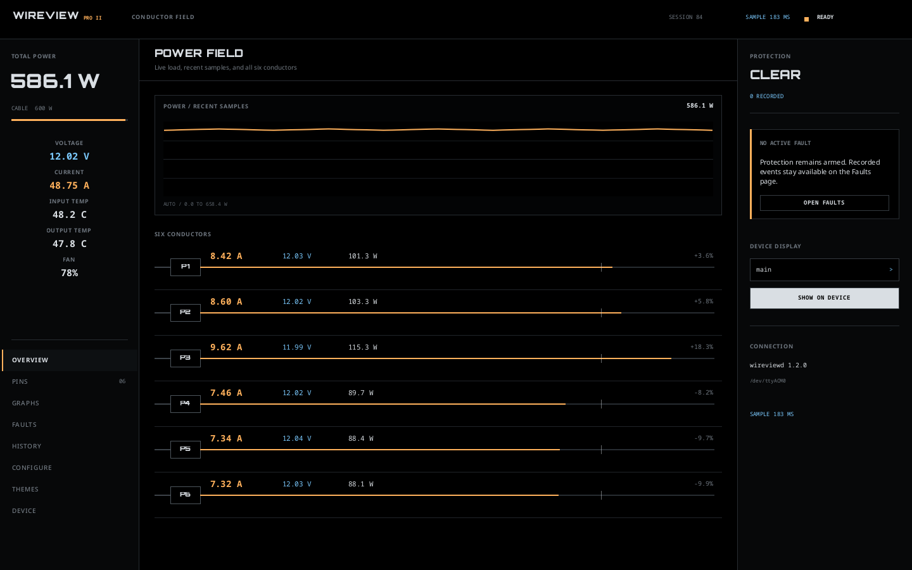
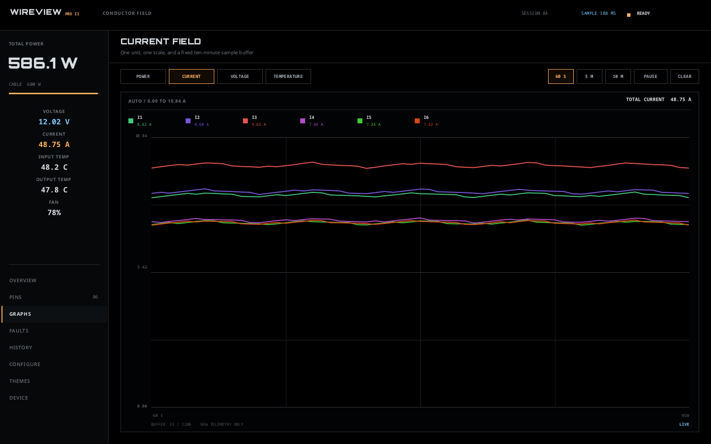

# WireView Pro II for Linux

WireView Pro II for Linux is a native desktop app, daemon, and command-line
client for the Thermal Grizzly WireView Pro II. It provides live telemetry,
device history, fault inspection, screen control, and validated configuration
through a local Varlink API.

The daemon owns all USB access, handles physical removal, re-enumeration, and
VM passthrough, and exposes the device to local clients through systemd socket
activation. Calibration, arbitrary flash operations, and firmware updates are
deliberately not exposed.

This is an independent community project and is not affiliated with Thermal
Grizzly.

<p align="center">
  
  
</p>

## Features

- Native Slint desktop app written entirely in Rust, with overview, live
  graphs, conductor, fault, history, configuration, theme, and device pages
- Automatic desktop reconnect, stale-sample state, guarded writes, accessible
  controls, system tray integration, and deterministic demo screens
- Human-readable and JSON live telemetry, including an in-place watch mode
- Table, CSV, JSON, and exact-raw device-history export
- Exact RGB565 backup and guarded, verified replacement of eight named theme
  asset slots
- Complete validated configuration read, temporary apply, permanent store,
  reload, and factory reset
- Individual configuration get/set commands
- Screen selection, fault inspection, and selective fault clearing
- Device identity, firmware, build, and capability reporting
- Automatic cleanup and recovery across disconnects and abandoned clients
- Debian/Ubuntu, Fedora, and Arch packages with a hardened systemd service

## Components

The repository builds and releases every component at one version:

| Component | Source | Responsibility |
|---|---|---|
| `wireviewd` | [`src/`](src/) | Owns USB access, device state, and the Varlink service |
| `wireview` | [`src/bin/wireview.rs`](src/bin/wireview.rs) | Provides command-line monitoring and device control |
| `wireview-gui` | [`crates/wireview-gui/`](crates/wireview-gui/) | Provides the native Slint desktop application |
| `wireview-core` | [`crates/wireview-core/`](crates/wireview-core/) | Defines the shared domain model and binary codecs |
| `wireview-ipc` | [`crates/wireview-ipc/`](crates/wireview-ipc/) | Defines the typed Varlink client contract |

## Install

Install the package for your distribution:

```bash
# Debian or Ubuntu
sudo apt install ./wireviewd_1.2.0-1_amd64.deb

# Fedora
sudo dnf install ./wireviewd-1.2.0-1*.x86_64.rpm

# Arch Linux
sudo pacman -U ./wireviewd-1.2.0-1-x86_64.pkg.tar.zst
```

Enable socket activation:

```bash
sudo systemctl enable --now wireviewd.socket
sudo usermod --append --groups wireview-client "$USER"
```

Log out and back in after joining `wireview-client`. Membership authorizes both
clients, including validated device writes, without granting direct USB access.
The package creates `wireview-client` during installation. If
`usermod` reports that the group does not exist, install or upgrade the package
before running it; an older or manually staged installation is still active.

Every package installs `/usr/bin/wireview-gui`, `/usr/bin/wireview`,
`/usr/bin/wireviewd`, a desktop launcher and icon, a `wireview(1)` manual page,
shell completions, the Varlink IDL, and service files. Members of
`wireview-client` may use both clients; the separate `wireview` group is
reserved for the daemon's direct USB access.

## Quick start

```bash
wireview-gui
wireview status
wireview info
wireview telemetry
wireview telemetry --watch
wireview history --format csv --output history.csv
wireview theme read fan-dark-1 --output fan-dark-1.raw
wireview theme write fan-dark-1 fan-dark-1.raw --yes
wireview faults
wireview config show
wireview config get fan.mode
wireview config set fan.mode fixed
wireview screen help
```

Use `wireview --help` and `wireview COMMAND --help` for the command reference.
Permanent configuration changes and destructive recovery actions require an
explicit `--yes`.

## Documentation

- [Desktop app guide](docs/desktop.md)
- [CLI usage and complete configuration reference](docs/usage.md)
- [Service operation, USB/VM handling, and troubleshooting](docs/operations.md)
- [Hardware and firmware compatibility](docs/compatibility.md)
- [Varlink API and stability policy](docs/varlink.md)
- [Recovered USB protocol](docs/protocol.md)
- [Building, testing, packaging, and releases](docs/development.md)
- [Attended release qualification](docs/release-qualification.md)
- [Package payload and hooks](packaging/README.md)

## Build

The workspace uses Rust 1.97.1, pinned in `rust-toolchain.toml`, plus
`pkg-config`, libudev development headers, and Fontconfig development headers.

```bash
cargo build --release --workspace --bins --locked
cargo test --workspace --all-targets --locked
cargo clippy --workspace --all-targets --all-features --locked -- -D warnings
```

Build installable packages with:

```bash
bash scripts/build-packages.sh
```

See [development and releases](docs/development.md) for native package
dependencies, verification, fuzzing, build identities, and hardware tests.

## License

MIT
